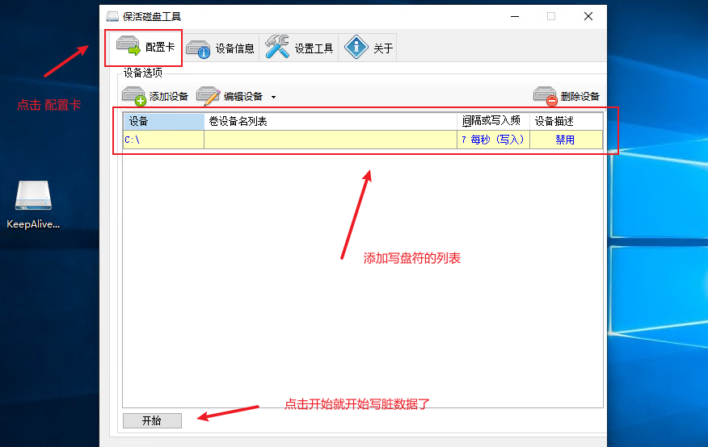

### 保活软件使用场景几种情况介绍

-   背景介绍

    假如你有一个台式机电脑或者额外笔记本外挂了一些移动形式上的机械硬盘或者超大移动硬盘，又或者是

    你是一个资深存储方面的玩家，也不想买昂贵NAS设备，那么这个软件比较合适你使用，这款软件主要是用在

    机械硬盘在电脑或者服务器使用情况中有一段时间没有读写情况下又产生读写的话，机械硬盘会在系统内重新

    进行一次加载然后进行初始化状态挂载，这一个过程大概需要1-2分钟【其中还不算上设备是否来老旧】。

-   附加留言：

    -   另外一种情况就是你和我一样属于比较传统的陈列选手，买了一个阵列盒子通过TYPE-C接口直通在电脑

        背后上面的话，也可以用这个软件，我本人使用的是绿联5盘位阵列盒子，因为盒子有默认保持机制的情况

        当你的阵列盒子在没有持续性使用情况下它会休眠停止，当你有产生读写需要的时候它会初始化加数据，

        整个过程中会有卡顿延迟1-2分钟的反应时间，这个周期内电脑的文件夹资源管理员UI会卡住，为了让阵列

        长时间保持活动状态，发布了该软件。

安装步骤1：

-   双击程序图标打开程序

    -   鼠标-》双击程序启动后会看到程序主界面

    -   截图

        

步骤2：

-   查看磁盘列表

    -   鼠标点击-》设备信息选项卡-》列表出现的盘符是当前电脑所有磁盘信息列表，如果插了U盘或者移动硬盘或者机械硬盘还是说磁盘阵列等等外设存储设备，以及电脑自身的硬盘都会在这个列表里面罗列出来的。

    -   截图

        

        

        

步骤3：

-   添加盘符开始写入LOG进行保活

    -   说明：列表里面有很多磁盘列表，选择你的机械硬盘的盘符或者磁盘阵列的盘符，然后 点击选择所有设备添加，弹出窗口名：多设备设置选项，在这个小窗口里面选择你要写入指定盘符里面的log脏数据文件的频率，比如说多少秒，多少分钟，多少个小时，授权勾选，点击允许就搞定了。

    -   截图

        

        

    -   添加盘符成功之后，点击配置卡选项就可以看到你添加的磁盘列表了

    -   这里我演示为目的选择了C盘，假设你的C盘跟我一样是一个磁盘真理盒子的盘符或者指定机械磁盘的盘符

        在间隔几秒钟后就可以看到写入的log日志文件了。

        

        
